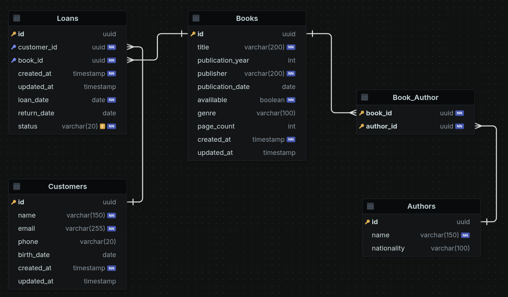

## Modelagem de Dados

### Customer

* id (PK) — UUID, NOT NULL
* name — VARCHAR(150), NOT NULL
* email — VARCHAR(255), NOT NULL
* phone — VARCHAR(20), optional
* birthDate — DATE, optional
* createdAt — TIMESTAMP, NOT NULL
* updatedAt — TIMESTAMP, optional

### Author

* id (PK) — UUID, NOT NULL
* name — VARCHAR(150), NOT NULL
* nationality — VARCHAR(100), optional

### Book

* id (PK) — UUID, NOT NULL
* title — VARCHAR(200), NOT NULL
* publicationYear — INT, optional
* publisher — VARCHAR(200), NOT NULL
* publicationDate — DATE, optional
* available — BOOLEAN, NOT NULL
* genre — VARCHAR(100), optional
* pageCount — INT, optional
* createdAt — TIMESTAMP, NOT NULL
* updatedAt — TIMESTAMP, optional

### Loan

* id (PK) — UUID, NOT NULL
* customerId (FK) — UUID, NOT NULL, references Customer(id)
* bookId (FK) — UUID, NOT NULL, references Book(id)
* createdAt — TIMESTAMP, NOT NULL
* updatedAt — TIMESTAMP, optional
* loanDate — DATE, NOT NULL
* returnDate — DATE, optional
* status — NOT NULL ENUM { active / returned }

### BookAuthor

* bookId (PK, FK) — UUID, NOT NULL, references Book(id)
* authorId (PK, FK) — UUID, NOT NULL, references Author(id)

### Relationships

* Customer 1:N Loan
* Book 1:N Loan
* Book N:N Author — through BookAuthor

